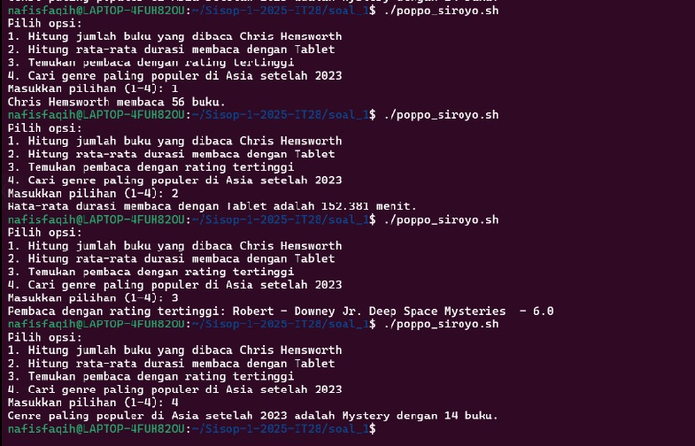
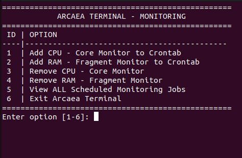
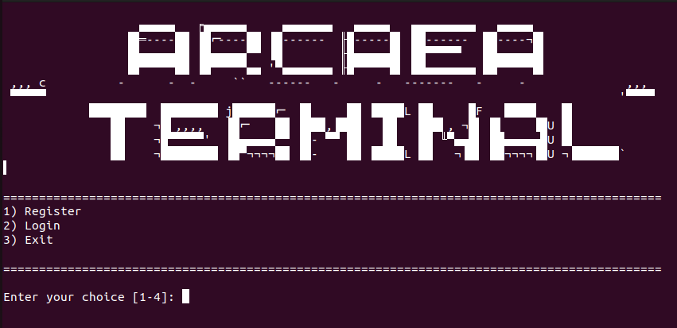
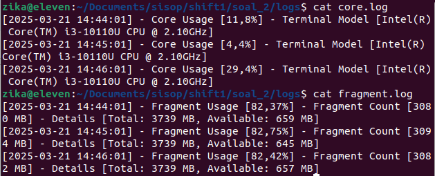
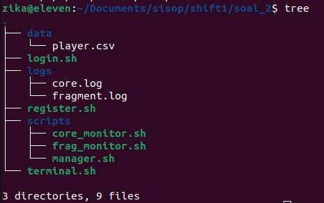

# Laporan Praktikum IT28
## Yuan Banny Albyan - 5027241027
## Ica Zika Hamizah - 5027241058
## Nafis Faqih Allmuzaky Maolidi - 5027241095

## Soal_1
### Buat Folder Repository, untuk membuat folder bernama soal_1 gunakan kode tersebut
```sh
mkdir soal_1
```

### untuk Masuk ke Folder soal_1 
```sh
cd soal_1
```
### Mengunduh file dari google drive
```sh
wget https://drive.usercontent.google.com/u/0/uc\?id\=1l8fsj5LZLwXBlHaqhfJVjz_T0p7EJjqV\&export\=download -O reading_data.csv
```
### Buat File poppo_siroyo.sh, Gunakan perintah berikut untuk membuat file shell script
```sh
touch poppo_siroyo.sh
```
### Beri Izin Eksekusi ke Script
```sh
chmod +x poppo_siroyo.sh
```

### Setelah membuat Struktur Repository, Buka file poppo_siroyo.sh dengan editor nano
```sh
nano poppo_siroyo.sh
```

### Kemudian, tambahkan kode berikut
```sh
#!/bin/bash

# Nama file dataset
DATA_FILE="reading_data.csv"

# Periksa apakah file ada
if [[ ! -f "$DATA_FILE" ]]; then
    echo "File $DATA_FILE tidak ditemukan. Pastikan file ada di direktori yang sama."
    exit 1
fi

# Menampilkan menu pilihan
echo "Pilih opsi:"
echo "1. Hitung jumlah buku yang dibaca Chris Hemsworth"
echo "2. Hitung rata-rata durasi membaca dengan Tablet"
echo "3. Temukan pembaca dengan rating tertinggi"
echo "4. Cari genre paling populer di Asia setelah 2023"
read -p "Masukkan pilihan (1-4): " pilihan

# pilihan 1
if [[ "$pilihan" -eq 1 ]]; then
    jumlah=$(awk -F',' 'NR>1 && $2 ~ /Chris Hemsworth/ {count++} END {print (count ? count : 0)}' "$DATA_FILE")
    echo "Chris Hemsworth membaca" $jumlah "buku."

elif [[ "$pilihan" -eq 2 ]]; then
    rata_rata=$(awk -F',' 'NR>1 && $8 ~ /Tablet/ {sum += $6; count++} 
        END {if (count > 0) print sum / count; else print "0"}' "$DATA_FILE")
    echo "Rata-rata durasi membaca dengan Tablet adalah" $rata_rata "menit."

elif [[ "$pilihan" -eq 3 ]]; then
    hasil=$(awk -F',' 'NR > 1 {if ($7 > max) {max=$7; name=$2; title=$3}} 
        END {print name, title, max}' "$DATA_FILE")

    nama=$(echo "$hasil" | awk '{print $1}')
    judul=$(echo "$hasil" | awk '{$1=""; $NF=""; print $0}' | sed 's/^ *//')
    rating=$(echo "$hasil" | awk '{print $NF}')

    echo "Pembaca dengan rating tertinggi: $nama - $judul - $rating"

elif [[ "$pilihan" -eq 4 ]]; then
    hasil=$(awk -F',' 'NR>1 && $5 > "2023-12-31" && $9 ~ /Asia/ {genre_count[$4]++} 
        END {
            max=0; 
            for (g in genre_count) 
                if (genre_count[g] > max) { 
                    max=genre_count[g]; 
                    popular=g;
                } 
            print popular, max
        }' "$DATA_FILE")

    genre=$(echo "$hasil" | awk '{print $1}')
    jumlah=$(echo "$hasil" | awk '{print $2}')
    
    echo "Genre paling populer di Asia setelah 2023 adalah $genre dengan $jumlah buku."
fi`
```

### Setelah menambahkan kode, cek apakah file reading_data.csv ada.
`reading_data.csv`

### Jalankan perintah berikut di terminal, Kemudian pilih nomor sesuai pertanyaan yang ingin dijawab.
`./poppo_siroyo.sh`

### Output


## Soal_2
#### Buatlah dua shell script, login.sh dan register.sh, yang dimana database “Player” disimpan di /data/player.csv. Untuk register, parameter yang dipakai yaitu email, username, dan password. Untuk login, parameter yang dipakai yaitu email dan password.
`mkdir soal_2 && touch login.sh && touch register.sh` kemudian `cd soal_2 && nano register.sh`
### Untuk register.sh
inisiasi lokasi database `DB_FILE = "/data/player.csv`
```sh
if [ ! -f "$DB_FILE" ]; then
    bash "sudo mkdir $DB_FILE"
    echo "email,username,hpassword,password" > "$DB_FILE"
fi
```
membuat file player.csv dan memasukkan header, bila player.csv belum ada
`validate_input()` = fungsi untuk memvalidasi input untuk ketentuan (2.b)

#### Email harus memiliki format yang benar dengan tanda @ dan titik, sementara password harus memiliki minimal 8 karakter, setidaknya satu huruf kecil, satu huruf besar, dan satu angka
```sh
local valid=0
while [ $valid -eq 0 ]; do
```
boolean valid diset false, dan selama tidak valid akan meminta user untuk input dengan ketentuan yang ada.
membaca input dari user, dan set valid sebagai 1 (positive thinking user bisa masuk).
```sh
read -p "Input Username: " username
read -p "Input Email: " email
read -p "Input Password: " password
valid=1
```
constrain email (harus ada '@' dan '.'), dan jika email tidak sesuai, maka valid diset ke 0 lagi.
```sh
if [[ "$email" != *"@"* || "$email" != *"."* ]]; then
    echo "Error: Email must contain '@' and '.'"
    valid=0
fi
```
dari atas ke bawah, untuk constrain passwordnya, (minimal 8 karakter, ada uppercase, ada lowercase, ada angka)
```sh
if [ ${#password} -lt 8 ]; then
    echo "Error: Password must be at least 8 characters long."
    valid=0
fi
if ! [[ "$password" =~ [A-Z] ]]; then
    echo "Error: Password must include at least one uppercase letter."
    valid=0
fi
if ! [[ "$password" =~ [a-z] ]]; then
    echo "Error: Password must include at least one lowercase letter."
    valid=0
fi
if ! [[ "$password" =~ [0-9] ]]; then
    echo "Error: Password must include at least one number."
    valid=0
fi
```
#### login/register tidak bisa memakai email yang sama (email = unique)
menggunakan awk untuk membaca file player.csv, dengan flag -F (untuk menandakan pemisahnya ',' ) -v (untuk meng assign variabel global $email ke variabel awk Email untuk dicek mulai dari barus ke-2 `NR>1`
```sh
if awk -F',' -v Email="$email" 'NR>1 { if ($2 == Email) { exit 1 } }' "$DB_FILE"; then
    :  # Email belum didaftarkan, lanjutkan
else
    echo "Error: Email already taken!"
    valid=0
fi
```
#### Gunakan algoritma hashing sha256sum yang memakai static salt
```sh
hashed_password=$(echo -n "${password}STATIC_SALT" | sha256sum | awk '{print $1}')
```
kemudian masukkan ke DB_FILE `echo "$email,$username,$hashed_password,$password" >> "$DB_FILE"`

### Untuk bagian login.sh
inisiasi DB_FILE `DB_FILE="/data/player.csv"`
input email dan password 
```sh
read -p "Input Email: " email
read -p "Input Password: " password
```
echo / keluarkan output dengan percabangan:
- jika DB_FILE belum ada, maka keluarkan DB belum dibuat! Proses masuk ke Register, lalu diarahkan ke program register.sh setelah jeda 2 detik
- grep / mengambil elemen dari kolom pertama (karna email tempatnya di kolom pertama saat di register.sh), namun jika email bukan di kolom pertama, maka bisa diubah sintaksnya menjadi 
```sh
awk -F ',' -v e="$email" '$2 == e { found=1 } END { exit !found }' "$DB_FILE"
```
lalu diecho "email ditemukan"
- jika email ditemukan selanjutnya dicek apakah sama dengan yang ada di DB_FILES dengan mencocokkannya menggunakan awk dan hashing password dengan algoritma yang sama ketika register.
hashing:`hashed_password=$(echo -n "${password}STATIC_SALT" | sha256sum | awk '{print $1}')`
lalu cek menggunakan `awk -F ',' -v e="$email" -v h="$hashed_password" '$1 == e && $3 == h { found=1 } END { exit !found }' "$DB_FILE`
- jika email ada, kemudian email dan password benar maka output "login berhasil"
- jika email ada tapi awk salah, maka output "password salah"
- jika email tidak ditemukan output "email tidak ditemukan"
```sh
if [[ ! -f "$DB_FILE" ]]; then
   echo "DB belum dibuat! Proses masuk ke Register"
   sleep 2
   bash "./register.sh"
   exit 1
fi
if grep -q "^$email," "$DB_FILE"; then
    echo "✅ Email ditemukan"
    hashed_password=$(echo -n "${password}STATIC_SALT" | sha256sum | awk '{print $1}')

    if awk -F ',' -v e="$email" -v h="$hashed_password" '$1 == e && $3 == h { found=1 } END { exit !found }' "$DB_FILE"; then
        echo "✅ Login berhasil!"
    else
        echo "❌ Password salah!"
	exit 1
    fi
else
    echo "❌ Email tidak ditemukan!"
    exit 1
fi
```
- jika login berhasil maka lanjut output "berhasil" lalu diarahkan ke scripts/manager.sh

#### Sistem harus dapat melacak penggunaan CPU (dalam persentase) Lokasi shell script: ./scripts/core_monitor.sh
`mkdir scripts && touch scripts/core-monitor.sh' lalu memasukkan command 
```sh
cpu_model=$(grep "model name" /proc/cpuinfo | head -1 | cut -d ':' -f2 | sed 's/^ //')
```
berdasarkan stack overflow, kurang lebih: mengambil data dari /proc/cpuinfo (cpu info dari processor)
hasil grep nya itu `model name  : Intel(R) Core(TM) i7-9700 CPU @ 3.00GHz`, maka ditambahkan
head-1 untuk mengambil baris pertama nya saja `mengambil hanya baris pertama dari output grep.`
cut -d ':' delimiter dengan tanda ':'
-f2 ambil kolom kedua setelah delimiter `Intel(R) Core(TM) i7-9700 CPU @ 3.00GHz`
sed 's/^ //' untuk memanipulasi teks dengan `'s/^ //'` untuk menghapus spasi di awal teks jika ada

karna di sini program dapat memantau monitor secara terus menerus, maka dibuat loop
```sh
while true; do
   # Ambil CPU usage: hitung penggunaan CPU dari nilai idle
   cpu_usage=$(top -bn1 | grep "Cpu(s)" | sed "s/.*, *\([0-9.]*\)%* id.*/\1/" | awk '{printf "%.3f%%", 100 - $1}') 
clear # Bersihkan layar untuk update tampilan
```
atau
```sh
while true; do
   # Ambil CPU usage: hitung penggunaan CPU dari nilai idle
   cpu_usage=$(awk '{u=$2+$4; t=$2+$4+$5; if (NR==1){u1=u; t1=t;} else print ($2+$4-u1) * 100 / (t-t1) "%"; }' \ <(grep 	'cpu ' /proc/stat) <(sleep 1;grep 'cpu ' /proc/stat)) # Bersihkan layar untuk update tampilan
clear # Tampilkan header dan informasi
```

#### RAM menjadi representasi dari “fragments” di dunia “Arcaea”, yang dimana dipantau dalam persentase usage, dan juga penggunaan RAM sekarang. Lokasi shell script: ./scripts/frag_monitor.sh
karna tadi belum masuk ke folder scripts, maka bisa 'cd scripts && touch frag_monitor.sh' atau touch scripts/frag_monitor.sh`

1. cpu usage
menggunakan command yang sama seperti core_monitor

3. RAM usage
- menggunakan command yang sama seperti core_monitor, tapi di sini yang diambil adalah memori total dan memori yang digunakan
```sh
total_mem=$(free -m | awk '/Mem:/ {print $2}')
  used_mem=$(free -m | awk '/Mem:/ {print $3}')
```
free ini mengeluarkan keterangan memori dan swap, memori di sini harusnya adalah log untuk ram, kemudian flag -m digunakan untuk outputnya berupa MB, selanjutnya dipipe ke awk untuk mengeluarkan kolom ke 2 (total memori yang ada) dan kolom ke 3 (memori yang digunakan)
- menggunakan
```sh
ram_usage_percent=$(awk -v used="$used_mem" -v total="$total_mem" 'BEGIN {printf "%.2f", (used/total)*100}')
```
Untuk menghitung persentase penggunaannya dengan cara usage/total * 100

#### Pemantauan yang teratur dan terjadwal sangat penting untuk mendeteksi anomali. Crontab manager (suatu menu) memungkinkan "Player" untuk mengatur jadwal pemantauan sistem. Lokasi shell script: ./scripts/manager.sh
Untuk bisa mengakses core_monitor.sh dan frag_monitor.sh, dibuatlah script manager.sh yang berisi crontab memanggil core_monitor.sh untuk `add CPU` dan memnggil frag_monitor.sh untuk memanggil `add RAM`. Dalam manager.sh ada beberapa menu seperti pada gambar:


1. Menu 1 dan 2 adalah membuat crontab
```sh
CORE_SCRIPT="$(realpath "$(dirname "$0")/core_monitor.sh")"
FRAG_SCRIPT="$(realpath "$(dirname "$0")/frag_monitor.sh")"
function add_cron() {
    local script=$1
    local task_name=$2

    if crontab -l 2>/dev/null | grep -q "$script"; then
        echo "❌ $task_name is already in crontab!"
        return
    fi

    (crontab -l 2>/dev/null | grep -v "bin/bash .*$(realpath "$script")"; echo "* * * * * /bin/bash $(realpath "$script")") | crontab -
    echo "✅ $task_name successfully added to crontab every 1 minute!"
}
```
Dalam function ini pertama akan cek apakah ada crontab yang sudah dijalankan sebelumnya, jika ada maka tidak perlu membuat lagi. Jika crontab belum ada maka crontab dibuat dengan penjadwalan setiap satu menit, maka crontab fieldsnya `* * * * *` yang artinya setiap satu menit. Sesuai dengan pilihan jika memilih 1 maka add CPU yang berarti akan memanggil `CORE_SCRIPT` dan memilih 2 maka add RAM yang berarti akan memanggil `FRAG_SCRIPT`

2. Menu 2 dan 3 adalah menghapus crontab yang sedang berjalan
```sh
function remove_task() {
    local script=$1
    local task_name=$2

    if crontab -l 2>/dev/null | grep -q "$script"; then
        crontab -l 2>/dev/null | grep -v "bin/bash .*$(realpath "$script")" | crontab -
        echo "🗑️ $task_name successfully removed from crontab!"
    else
        echo "❌ $task_name not found in crontab!"
    fi

    local pids=$(pgrep -f "$script")
    if [[ -n "$pids" ]]; then
        echo "🛑 Stopping $task_name..."
        kill -9 $pids
        echo "✅ $task_name successfully stopped!"
    fi
}
```
Dalam function ini pertama akan cek crontab yang dipilih (add CPU/add RAM) apakah masih berjalan atau sudah berhenti, jika masih berjalan crontab akan dihapus terlebih dahulu dari data, lalu menggunakan `kill -9 $pids` untuk menghentikan prosesnya.

3. Menu 5 adalah list crontab job yang masih berjalan
```sh
function list_cron() {
    local cron_jobs=$(crontab -l 2>/dev/null)
    if [[ -z "$cron_jobs" ]]; then
        echo "📜 No scheduled tasks in crontab!"
    else
        echo "📜 Active crontab tasks:"
        echo "$cron_jobs"
    fi
}
```
Dalam function ini hanya mencari crontab yang sedang berjalan, jika ditemukan maka crontab ditampilkan. `cron_jobs` adalah variabel untuk menyimpan list crontab.

4. Menu 6 adalah menu keluar, user akan keluar dan kembali ke menu `arcaea terminal`


#### Karena tentunya script yang dimasukkan ke crontab tidak mengeluarkan output di terminal, buatlah 2 log file, core.log dan fragment.log di folder ./log/, yang dimana masing-masing terhubung ke program usage monitoring untuk usage tersebut. 
Setelah crontab dibuat, directory bernama `logs` otomatis dibuat dan berisikan `core.log` dan `fragment.log`


#### Tree hasil akhir soal_2 dijalankan


## Soal_3
### Langkah - Langkah

1. Pertama buat sebuah script "dsotm.sh" yang didalamnya berisi lima fungsi sesuai track yaitu Speak to Me, On the Run, Time, Money, dan Brain Damage.
```sh
nano dsotm.sh
```

2. Membuat program utama yakni menggunakan switch case dan buat 5 fungsi sesuai track yang diminta
```sh
speak_to_me(){
    # a. Speak to Me
}
on_the_run(){
    # b. On the Run
}
time_function(){
    # c. Time
}
money(){
    # d. Money
}
brain_damage(){
    # e. Brain Damage
}
# main program
TRACK=$1
TRACK=${TRACK//--play=/}

case "$TRACK" in
    "Speak to Me") speak_to_me ;;
    "On the Run") on_the_run ;;
    "Time") time_function ;;
    "Money") money ;;
    "Brain Damage") brain_damage ;;
    *) echo "Unrecognized track! Please choose from 'Speak to Me', 'On the Run', 'Time', 'Money', 'Brain Damage'." ;;
esac
```
Variabel `TRACK` diisi dengan argumen pertama `$1` yang diberikan saat menjalankan script sedangkan ekspresi `TRACK=${TRACK//--play=/}` digunakan untuk mengganti teks dalam variabel sehingga `--play=` dihapus dari nilai `TRACK`.

3. Fungsi `speak_to_me` berisi fitur yang memanggil API [affirmations](ttps://github.com/annthurium/affirmations) untuk menampilkan word of affirmation setiap detik.
```sh
speak_to_me(){
    clear
    tput civis # Menyembunyikan kursor terminal
    
    while true; do
        affirmation=$(  curl -s https://www.affirmations.dev | sed -E 's/\{"affirmation":"//; s/"\}//')
        echo -e "$affirmation"
        sleep 1
    done
}
```
- Menggunakan `curl` untuk mengambil data JSON dari API [affirmations](ttps://github.com/annthurium/affirmations)
- Opsi `-s` (silent) digunakan agar output tidak menampilkan informasi unduhan
- `sed` digunakan untuk membersihkan JSON dan hanya mengambil teks afirmasinya
- `s/\{"affirmation":"//; s/"\}//` → Menghapus `{"affirmation":"` dan `"}`

4. Fungsi `on_the_run` berisi sebuah progress bar yang berjalan dari 0% hingga 100% dengan interval random (setiap progress bertambah dalam interval waktu yang random dengan range 0.1 detik sampai 1 detik)
```sh
on_the_run(){
    clear
    tput civis
    length=$(($(tput cols) - 7))
    [ $length -lt 10 ] && length=10

    for i in $(seq 1 100); do
        
        sleep $(awk -v min=0.1 -v max=1 'BEGIN{srand(); print min+rand()*(max-min)}')

        progress=$((i * length / 100))
        progress_bar=$(printf "%0.s#" $(seq 1 $progress))

        printf "\r[%-${length}s] %3d%%" "$progress_bar" "$i"
    done
}
```
`tput cols` mengambil jumlah kolom dalam terminal (lebar terminal) sedangkan `length` adalah panjang maksimum progress bar, dikurangi 7 karakter untuk ruang label persen (100%).

```sh
[ $length -lt 10 ] && length=10
```
Jika panjang progress bar kurang dari 10 karakter, maka dipaksa menjadi 10 karakter agar tetap terlihat dengan baik

```sh
for i in $(seq 1 100); do
```
Perulangan dari 1 hingga 100 untuk membuat progress bar dari 0% hingga 100%

```sh
sleep $(awk -v min=0.1 -v max=1 'BEGIN{srand(); print min+rand()*(max-min)}')
```
Menggunakan awk untuk menghasilkan angka acak antara 0.1 hingga 1 detik agar bergerak dengan kecepatan yang bervariasi tidak konstan.

```sh
progress=$((i * length / 100))
```
Menghitung jumlah karakter # yang harus ditampilkan sesuai dengan persentase `progress`

```sh
progress_bar=$(printf "%0.s#" $(seq 1 $progress))
```
`seq 1 $progress` untuk membuat urutan angka dari 1 hingga $progress sedangkan `printf "%0.s#"` untuk mencetak karakter `#` sebanyak jumlah angka yang dihasilkan oleh `seq`

```sh
printf "\r[%-${length}s] %3d%%" "$progress_bar" "$i"
```
`\r` untuk menimpa baris yang sama
`[%-${length}s]` untuk menampilkan progress bar dengan panjang dinamis.
`%3d%%` untuk menampilkan angka persen yang selalu memiliki lebar 3 karakter untuk alignment


5. Fungsi `time_function` berisi live clock yang menunjukkan tanggal, jam, menit dan detik
```sh
time_function(){
    clear
    tput civis
    while true; do
        echo -ne "$(date '+%Y-%m-%d %H:%M:%S')"
        sleep 1
    done
}
```
- `$(date '+%Y-%m-%d %H:%M:%S')` menghasilkan tanggal & waktu saat ini dalam format `YYYY-MM-DD HH:MM:SS`
- `sleep 1` memberikan delay selama 1 detik

6. Fungsi `money` merupakan program mirip cmatrix dengan simbol mata uang seperti `$ € £ ¥ ¢ ₹ ₩ ₿ ₣`
```sh
money(){
    clear
    symbols=('$' '€' '£' '¥' '¢' '₹' '₩' '₿' '₣')
    colors=(5 6 7)

    cols=$(tput cols)
    rows=$(tput lines)
    declare -A positions

    for ((i = 0; i < cols; i++)); do
        positions[$i]=$((RANDOM % rows))
    done

    # Loop animasi
    while true; do
        for ((i = 0; i < cols / 2; i++)); do
            col=$((RANDOM % cols))

            symbol="${symbols[RANDOM % ${#symbols[@]}]}"
            color="${colors[RANDOM % ${#colors[@]}]}"

            tput cup "${positions[$col]}" "$col"
            echo " "

            new_pos=$((positions[$col] - 2))
            if (( new_pos < 0 )); then new_pos=$rows; fi
            positions[$col]=$new_pos

            # Set warna
            tput setaf $color
            if (( RANDOM % 10 < 3 )); then
                tput bold
            fi

            tput cup "$new_pos" "$col"
            echo -n "$symbol"

            # Reset warna
            tput sgr0
        done
        sleep 0.00000001
    done
}
```
`cols=$(tput cols)` untuk mengambil jumlah kolom atau lebar terminal,  `rows=$(tput lines)` untuk mengambil jumlah baris atau tinggi terminal, dan `declare -A positions` untuk mendeklarasikan array `positions`

```sh
for ((i = 0; i < cols; i++)); do
        positions[$i]=$((RANDOM % rows))
    done
```
loop ini mengisi `positions[$i]` dengan posisi acak dalam baris terminal untuk setiap kolom

```sh
for ((i = 0; i < cols / 2; i++)); do
            col=$((RANDOM % cols))
```
loop ini memilih setengah dari total kolom terminal untuk menampilkan simbol didalamnya terdapat `col` untuk menyimpan kolom acak untuk menampilkan simbol 

```sh
symbol="${symbols[RANDOM % ${#symbols[@]}]}"
            color="${colors[RANDOM % ${#colors[@]}]}"
```
`symbol` untuk memilih mata uang acak dari array `symbols` dan `color` untuk memilih warna acak dari array `colors`

```sh
tput cup "${positions[$col]}" "$col"
            echo " "
```
`tput cup x y` untuk memindahkan kursor ke posisi sebelumnya dan `echo " "` berguna untuk menghapus simbol sebelumnya dengan mencetak spasi

```sh
new_pos=$((positions[$col] - 2))
            if (( new_pos < 0 )); then new_pos=$rows; fi
            positions[$col]=$new_pos
```
Menghitung posisi baru dengan mengurangi 2 baris. Jika posisi baru kurang dari 0, maka diatur ulang ke baris paling bawah

```sh
tput setaf $color
            if (( RANDOM % 10 < 3 )); then
                tput bold
            fi
```
`tput setaf $color` untuk mengatur warna teks, 30% kemungkinan `( RANDOM % 10 < 3)` akan membuat simbol ditampilkan dalam teks tebal `tput bold`

```sh
tput cup "$new_pos" "$col"
            echo -n "$symbol"
```
memindahkan kursor ke posisi baru `$new_pos` dan `$col` lalu mencetak `$symbol` tanpa newline

7. Fungsi `brain_damage` menampilkan proses yang sedang berjalan, seperti task manager yang dapat menampilkan data baru setiap detiknya
```sh
brain_damage(){
    RESET='\033[0m'
    BOLD='\033[1m'
    PINK='\033[38;5;218m'
    BLUE='\033[38;5;117m'
    GREEN='\033[38;5;120m'
    YELLOW='\033[38;5;221m'
    PURPLE='\033[38;5;183m'
    WHITE='\033[1;37m'
    COLORS=("$PINK" "$BLUE" "$GREEN" "$YELLOW" "$PURPLE")
    clear
    tput civis
    stty -echo # Matikan echo agar terminal tetap rapi
    trap "tput cnorm; stty echo; exit" SIGINT  # Tampilkan kursor & kembalikan terminal saat keluar

    while true; do
        tput cup 0 0
        top_output=$(top -b -n 1 | head -n 22)

        IFS=$'\n' read -rd '' -a lines <<<"$top_output"

        for i in "${!lines[@]}"; do
            COLOR="${COLORS[$((i % ${#COLORS[@]}))]}"

            if [ $i -lt 5 ]; then
                echo -e "${BOLD}${COLOR}${lines[$i]}${RESET}"

            elif [ $i -eq 5 ]; then
                echo -e "${WHITE}${BOLD}${lines[$i]}${RESET}"

            else
                echo -e "${COLOR}${lines[$i]}${RESET}"
            fi

            if [[ $i -eq 4 ]]; then
                echo ""
            fi
        done

        sleep 1
    done
    tput cnorm
    stty echo # Aktifkan kembali input terminal
}
```
- `trap "tput cnorm; stty echo; exit" SIGINT` menangani CTRL+C untuk mengembalikan terminal ke keadaan semula
- Menggunakan `top -b -n 1 | head -n 22` untuk mendapatkan snapshot pertama dari proses yang berjalan
- Memisahkan output `top` menjadi array `lines` berdasarkan newline `(IFS=$'\n')`
- Mengiterasi setiap baris dalam `lines` dan menerapkan warna berdasarkan indeksnya
- Jika indeks `i < 5`, teks dicetak dengan warna tebal
- Jika `i == 5`, teks menggunakan warna putih tebal
- Berjalan tanpa henti, memperbarui output top setiap detik `sleep 1`
- Setelah keluar, kursor dikembalikan `tput cnorm` dan terminal dinormalisasi `stty echo`

## Soal_4
### Langkah - Langkah
- Program shell pokemon_analysis.sh dibuat untuk membantu menganalisis data penggunaan Pokémon yang terdapat pada file CSV, misalnya pokemon_usage.csv. Data tersebut memuat informasi penting seperti nama Pokémon, persentase penggunaan (Usage%), jumlah penggunaan (RawUsage), tipe, dan statistik (HP, Atk, Def, Sp.Atk, Sp.Def, Speed). Program ini ditujukan untuk memudahkan persiapan tim dalam turnamen “Generation 9 OverUsed 6v6 Singles” dengan menampilkan informasi meta secara ringkas dan terurut.
1. Mempersiapkan workspace
```sh
mkdir soal_4 && cd soal_4 && wget https://drive.usercontent.google.com/u/0/uc?id=1n-2n_ZOTMleqa8qZ2nB8ALAbGFyN4-LJ&export=download -O pokemon_analysis.csv
nano pokemon_analysis.sh
```
### Fitur Utama:
1. Summary Data, Menampilkan ringkasan data dari Pokemon dengan Highest Adjusted Usage (Usage% tertinggi), serta Pokemon dengan Highest Raw Usage (jumlah penggunaan terbanyak)
2. Sorting Data, Mengurutkan seluruh data berdasarkan kolom yang diinginkan, antara lain: { Pokemon, Usage%, RawUsage, Hp, Atk, Def, SpAtk, SpDef, Speed, Type1, Type2} secara descending (dari kecil ke besar)
3. Pencarian, Mencari Pokémon berdasarkan nama secara case-insensitive, yang memastikan ditampilkannya Pokemon yang sesuai dengan keyword yang dicari.
4. Filter, Memungkinkan pengguna untuk memfilter data berdasarkan tipe (misal: Dark, Electric, dsb.), sehingga hanya Pokemon dengan tipe yang sesuai yang ditampilkan.
5. Help Page, Tampilan yang berisi penjelasan fitur dari program shell ini

#### command untuk menjalankan program: 
```sh
./pokemon_analysis.sh [nama file csv] [option] [argumen]
```

2. Membuat fitur help page
```sh
if [[ "$1" == "-h" || "$1" == "--help" ]]; then
    cat <<'EOF'
                                ,▄█▄
                                        ▄█▀ ▓█
           ,▄▄▄▓▓▓▄▄,     ,▄▄▓▓████▄, ▄██▄██▄ ,▄▄▄▄██▀▀█U   ,▄▄,
       ▄▄█▀╙        ▀█Ç  ▐██▄  ▐█"  ▀██▀▀' '▀▀██▌  '█  ▐▌   ██▌▀▀▀███▄▄▄,
      ╙██▌      ╥▄▄  ]█ ,▐███      ▄██  ▌▓█ ▄███    ⁿ   █▄▄Ñ███   '██   █C
        ████▄   └█▐▌ ▄█▀▐@ ╙▀▌   -███▌  ▀╙»▀▀╙██,      ▄█¬█╜ ,└█   ▓Ü  █▌
         ▀▀██▄   ╙"╓██  ██▄▓ ▓▌ ▄    ▀█▄   ,▄▄█▌  ▓▄ ▄¬█  ▀██▀ █D¿ `  ▐█
           ╙██▄   ███▌   '  ,█  ████▄, ╙▀██▀▀██▄▄▄████ █▄    ,▓▀ ▌   ┌█
            ╙██▄  └████▄,,▄▓██,╓█C ▀▀███▄█P  ╙▀▀▀▀▀███▄▄▄█████Ç ]█   █╩
             ▐██▄  ▓▌╙▀▀▀▀╙└▀▀▀▀▀      ╙▀▀          ╙▀▀▀▀█▀ ▀▀████  ▓▌
              ▐████▀▀                                           ▀████ `

EOF
cat << 'EOF'
 ---------------------------------------------------------------------------------------
| Usage: ./pokemon_analysis1.sh <file_name> [options]                                   |
|                                                                                       |
| Options:                                                                              |
| -h, --help    Display this help message.                                              |
| -i, --info    Show the highest adjusted and raw usage.                                |
| -s, --sort <col>  Sort data by column							|
| -g, --grep <name> Search for a specific Pokemon by name.                              |
| -f, --filter <type> Filter Pokemon by type.                                           |
| column you can call to the command:							|
| + Pokemon	+ Type2	  + SpDef							|
| + Usage%	+ HP	  + SpAtk							|
| + RawUsage	+ Atk	  + Speed							|
| + Type1	+ Def									|
 ---------------------------------------------------------------------------------------
EOF
    exit 0
fi

FILE="$1"
OPTION="$2"
ARGUMENT="$3"
```
- `if [[ "$1" == "-h" || "$1" == "--help" ]];then . . . fi` bagian ini merupakan gerbang, yang apabila flag / optionnya adalah -h atau --help, maka bagian help ini akan jalan
- `cat << 'EOF' . . . EOF` bagian ini mengeluarkan baris yang ada di antara cat << 'EOF' sampai EOF
- `exit 0` adalah tanda berakhirnya program tanpa eror
- `FILE="$1" OPTION="$2" ARGUMENT="$3"` bagian ini menginisiasi urutan input dari command seperti
`./pokemon_analysis.sh [nama file csv] [option] [argumen]`

```sh
if [[ -z "$FILE" || ! -f "$FILE" ]]; then
    echo "Error: File not found or not specified."
    echo "Usage: ./pokemon_analysis1.sh <file_name> [options]"
    exit 1
fi
```
- error handling agar mengakhiri sesi dan mengeluarkan pesan apabila file tidak ditemukan

3. Membuat fitur summary
```sh
case "$OPTION" in
    -i|--info)
        echo "Summary of $FILE"	
	awk -F ',' '
	   NR > 1 {
     	   	  if ($2 > maxUsage) {
      	   	    maxUsage = $2
       	   	    maxPokemon = $1
     	   	  }
    	   	  if ($3 > maxRaw) {
       	   	    maxRaw = $3
      	   	    maxRawPokemon = $1
     	   	  }
   	    	}
   	   END {
     		print "_____________________________________________________________"
     		print "| Summary of " FILENAME
     		print "| Highest Adjusted Usage: " maxPokemon, maxUsage "% uses    "
     		print "| Highest Raw Usage:      " maxRawPokemon, maxRaw, "uses    "
     		print "_____________________________________________________________"
   	       }' "$FILE"

        ;;
```
- Menggunakan switch case untuk menjadi gerbang nya, dan untuk fitur summary, menggunakan -i atau --info
- `awk -F ',' '` mendefinisikan pemisah kolomnya adalah (,)
- `NR > 1` Mulai dari baris ke 2 (>1) lakukan pencarian `Usage%` dan `RawUsage` terbesar
- mengeluarkan kesimpulan dari pencarian `Usage%` dan `RawUsage` data terbesarnya
```sh
{
  print "_____________________________________________________________"
  print "| Summary of " FILENAME
  print "| Highest Adjusted Usage: " maxPokemon, maxUsage "% uses    "
  print "| Highest Raw Usage:      " maxRawPokemon, maxRaw, "uses    "
  print "_____________________________________________________________"
}' "$FILE"
```
   
6. Membuat fitur Sorting
```sh
-s|--sort)
    	if [[ -z "$ARGUMENT" ]]; then
           echo "Error: Sorting column not specified."
           exit 1
    	fi
    	column=$(head -1 "$FILE" | awk -v arg="$ARGUMENT" -F',' '{for(i=1; i<=NF; i++) if ($i == arg) print i}')
	if [ -z "$column" ]; then
       	   echo "Error: Invalid sorting column"
       	   exit 1
    	fi

    	echo "_____________________________________________________________"
    	echo "| Sorting by column: $ARGUMENT"
    	echo "-------------------------------------------------------------"
    	awk -F',' 'NR>1 { print }' "$FILE" \
      | sort -t',' -fk"$column","$column"
	echo "_____________________________________________________________"
    ;;
```
- Menggunakan error handling, apabila Argumen nya tidak ada
```sh
if [[ -z "$ARGUMENT" ]]; then
     echo "Error: Sorting column not specified."
     exit 1
fi
```
- `column=$(head -1 "$FILE" | awk -v arg="$ARGUMENT" -F',' '{for(i=1; i<=NF; i++) if ($i == arg) print i}')`
+ `head -1 "$FILE"` mengambil baris pertama (header) dari file CSV.
+ `awk -F',' ...` membaca baris tersebut sebagai data yang dipisahkan koma.
+ Variabel `arg` di-pass dari Bash ke `awk (-v arg="$ARGUMENT")` untuk membandingkan tiap kolom ($i) dengan $ARGUMENT.
+ `-v` Berfungsi untuk mendefinisikan variabel AWK dari luar skrip. Misalnya, `-v arg="$ARGUMENT"` membuat variabel `arg` di dalam awk bernilai sama dengan `$ARGUMENT` di shell.
+ Jika kolom cocok, awk mencetak nomor kolomnya (print i) dan memasukkannya ke column.

- Error handling apabila column tidak ada di header file csv
```sh
if [ -z "$column" ]; then
    echo "Error: Invalid sorting column"
    exit 1
fi
```
```sh
awk -F',' 'NR>1 { print }' "$FILE" | sort -t',' -fk"$column","$column"
```
- `awk -F',' 'NR>1 { print }'` mencetak semua baris CSV kecuali baris pertama (header), dan hasilnya di-pipe ke perintah sort.
- `sort -t','` berarti pemisah kolom untuk sortir adalah tanda koma `(,)`.
- `-fk"$column","$column"` berarti sort dengan key (kunci) pada kolom `$column`, dengan `-f (fold case)` untuk mengabaikan perbedaan huruf besar/kecil.

#### *Revisi*
```sh
if [[ "$column" -eq 1 ]]; then
    awk -F',' 'BEGIN { OFS="," } NR>1 { print }' "$FILE" | sort -t',' -k"$column","$column" -n
else
    awk -F',' 'BEGIN { OFS="," } NR>1 { print }' "$FILE" | sort -t',' -k"$column","$column" -n -r
fi
```
cara sederhana agar ketika yang disort adalah nama pokemon, maka ascendinng dari a ke z, dan yang lainnya descending, dari terbesar ke terkecil

  
8. Membuat fitur Pencarian
```sh
-g|--grep)
    	if [[ -z "$ARGUMENT" ]]; then
           echo "Error: Pokemon name not specified."
           exit 1
    	fi

    	echo "_____________________________________________________________"
    	echo "| Searching for Pokemon with name: $ARGUMENT"
    	echo "-------------------------------------------------------------"
    	grep -i "$ARGUMENT" "$FILE"
    	echo "_____________________________________________________________"
    	;;
```
- Error handling jika tidak ada argumen dalam command bash nya
```sh
if [[ -z "$ARGUMENT" ]]; then
     echo "Error: Pokemon name not specified."
     exit 1
fi
```
- `grep -i "$ARGUMENT" "$FILE"` mencari argumen dari file tanpa memperhatikan kapital/ tidak (case-insensitive)

#### *Revisi*
```sh
awk -F',' 'NR>1 { print }' "$FILE" | awk -F',' -v name="$ARGUMENT" 'tolower($1) ~ tolower(name)' | sort -t',' -k2 -n -r
```
intinya bagian ini merubah logic agar yang dicari hanya dari $1 (nama pokemon) lalu disort berdasarkan k2 (usage)


10. Membuat fitur Filter
```sh
-f|--filter)
    	if [[ -z "$ARGUMENT" ]]; then
           echo "Error: Pokemon type not specified."
           exit 1
    	fi

    	echo "_____________________________________________________________"
    	echo "| Filtering Pokemon by type: $ARGUMENT"
    	echo "-------------------------------------------------------------"
    	awk -F',' -v type="$ARGUMENT" '$4 ~ type' "$FILE"
    	echo "_____________________________________________________________"
    	;;
```
- Error handling, menampilkan pesan error apabila argumen nya kosong
- `awk -F',' -v type="$ARGUMENT" '$4 ~ type' "$FILE"`  digunakan untuk filternya
- `-F','`: Menentukan bahwa pemisah (delimiter) dalam file CSV adalah tanda koma.
- `-v type="$ARGUMENT"`: Mengirimkan nilai dari $ARGUMENT ke variabel type di dalam AWK.
- `'$4 ~ type'`: Memeriksa setiap baris (kecuali header jika tidak diabaikan sebelumnya) dan memilih baris di mana kolom ke-4 (yang biasanya berisi tipe Pokémon) cocok dengan pola yang disimpan di variabel type. Operator ~ digunakan untuk pencocokan pattern (regex).
- `"$FILE"`: Menunjukkan nama file CSV yang berisi data Pokémon.

#### *Revisi*
```sh
awk -F',' -v type="$ARGUMENT" '($4 ~ type) || ($5 ~ type)' "$FILE" | sort -t',' -k2 -n -r
```
menambahkan yang difilter `($4 ~ type) || ($5 ~ type)` sebelumnya hanya `($4 ~ type)`, efeknya, yang dicari itu type1 dan type2

11. Error handling, apabila option tidak valid
```sh
*)
        echo "Error: Invalid option."
        echo "Usage: ./pokemon_analysis1.sh <file_name> [options]"
        exit 1
        ;;
```
